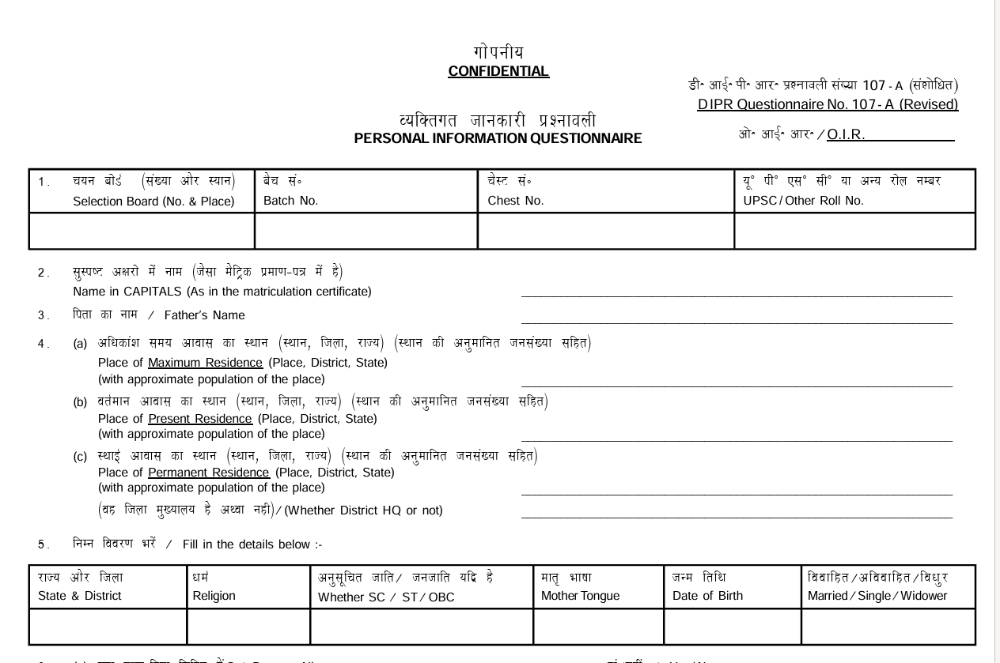
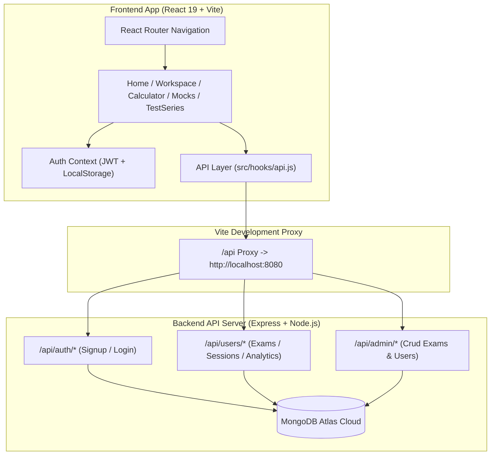

<div align="center">

  # 🛡️ DefenceRoger — Frontend Suite

  <p align="center">
    <strong>India’s Premier Defense Entry Scheme Eligibility Diagnostics & SSB Interview Preparation Suite</strong>
  </p>

  <p align="center">
    
    
    
    
    
  </p>

  <br />

  

</div>

---

## 🌟 Overview

**DefenceRoger** is a modern, ultra-responsive web platform built to guide defense aspirants preparing for **UPSC NDA, CDS, AFCAT, TES, TGC, JAG, and NCC Special Entries**. 

It combines precise **date-of-birth age calculations**, multi-criteria **qualification diagnostics**, interactive **SSB 5-Day interview workspace modules**, timed **mock test sessions** with KaTeX mathematical typesetting, and candidate **performance analytics**.

---

## 📸 Visual Showcase & Key Features

### 1. Defense Entry Eligibility Calculator Engine
Calculates candidate age down to exact years and decimal months against official cut-off dates (e.g. `2026-07-01`), evaluating eligibility across 15+ Armed Forces entry schemes.

<div align="center">
  
</div>

> [!TIP]
> Checks streams (PCM / General), degree completion status, JEE Main mandatory ranks (TES / B.Tech Navy), NCC 'C' Certificates, and remaining attempt counters.

---

### 2. Defense Preparation Workspace Modules
Interactive detail modules providing visual breakdowns for all major selection phases:
- **SSB 5-Day Selection Pipeline**: Screening (OIR/PPDT), Stage-II Psych Tests (TAT, WAT, SRT, SDT), GTO Obstacles, and Board Conference.
- **Candidate Cutoff Monitor**: Historic and predicted written exam cutoff statistics.
- **15 Officer-Like Qualities (OLQ) Framework**: Factor-wise breakdown (Planning, Social Adjustment, Dynamic Traits, Emotional Stability).

<div align="center">
  
</div>

---

### 3. Timed Mock Test & Exam Simulator
Full-featured exam interface featuring:
- **KaTeX (LaTeX) Mathematical Rendering**: Crisp typesetting for complex math formulas in NDA & CDS questions.
- **Per-Question Timers & Progress Palette**: Color-coded question status (Answered, Unanswered, Current).
- **Auto-Submission & Idempotent Finalization**: Seamless session sync with the backend Express API.

---

## 🏗️ Architecture Flow



---

## 🛠️ Tech Stack & Ecosystem

| Layer | Technology | Purpose |
| :--- | :--- | :--- |
| **Framework** | React 19 (`react`, `react-dom`) | Component architecture & dynamic state rendering |
| **Routing** | React Router DOM v7 | Client-side routing with protected layout guards |
| **Styling** | Tailwind CSS v4 + `@tailwindcss/vite` | Modern utility-first CSS design system |
| **Animations** | Framer Motion & GSAP | Smooth page transitions, parallax layers, and modal dynamics |
| **Math Typesetting** | KaTeX (`katex`, `react-katex`) | Rendering LaTeX mathematical expressions |
| **Icons** | Lucide React & Phosphor Icons | Clean vector iconography |
| **Build Tool** | Vite v8 | High-speed HMR development & optimized production bundling |

---

## 📁 Folder Structure

```text
Frontend/new-ft/
├── public/
│   ├── images/          # Platform visuals & banner assets
│   ├── blogs/           # Static SSB candidate story data
│   └── icons.svg
├── src/
│   ├── assets/          # Custom typography fonts (Deltha, Megunso, Runtime)
│   ├── components/
│   │   ├── ui/          # Logo, DefenseBentoGrid, PageTransition, ParallaxComponent
│   │   └── hero/        # SlidingEaseVerticalBars
│   ├── hooks/
│   │   ├── api.js       # Centralized API fetch wrapper & eligibility engine
│   │   └── useAuth.jsx  # React Auth Provider & Session Context
│   ├── Layouts/
│   │   ├── Header.jsx   # Top navigation bar & mobile drawer
│   │   ├── Footer.jsx   # Footer links & copyright info
│   │   └── ProtectedRoute.jsx # Route authentication guard
│   ├── Routes/
│   │   ├── Home/        # Hero section, Bento Grid, 15 OLQs
│   │   ├── Calculator/  # Multi-criteria eligibility calculator
│   │   ├── Workspace/   # Visual workspace detail modules (/workspace/:id)
│   │   ├── TestSeries/  # Exam list, Mock test session, Results, Analytics
│   │   ├── Mocks/       # Downloadable PYQs library
│   │   ├── SSBDocuments/# SSB interview document checklist & PIQ form guide
│   │   └── Admin/       # Admin management dashboard (Exams, Tests, Users)
│   ├── App.jsx          # Main route registrations
│   ├── index.css        # Tailwind v4 import & font source-of-truth
│   └── main.jsx         # Application entry point
├── vite.config.js       # Port 8080 API proxy configuration
└── package.json
```

---

## 🚀 Getting Started

### Prerequisites
- **Node.js**: `v18.0.0` or higher
- **npm**: `v9.0.0` or higher

### Installation

1. **Clone the repository**:
   ```bash
   git clone https://github.com/SAURABH-sys-png/new-ft.git
   cd new-ft
   ```

2. **Install dependencies**:
   ```bash
   npm install
   ```

3. **Start local dev server**:
   ```bash
   npm run dev
   ```
   The application will launch at **`http://localhost:5173`**.

4. **Build for production**:
   ```bash
   npm run build
   ```

---

## 🔌 Backend API Connection & Proxy Configuration

During development, `/api` requests are automatically proxied via Vite to the running backend server:

```javascript
// vite.config.js
export default defineConfig({
  server: {
    port: 5173,
    proxy: {
      '/api': {
        target: 'http://localhost:8080',
        changeOrigin: true,
        secure: false,
      },
    },
  },
});
```

---

<div align="center">
  <p>Made with ❤️ for Indian Defense Aspirants</p>
  <p><strong>DefenceRoger — Know Your Eligibility. Own Your SSB.</strong></p>
</div>
